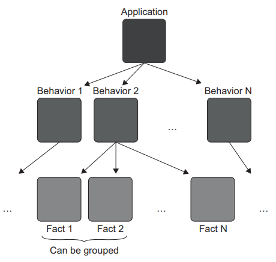

Chapter 3-The Anatomy of a Unit Test
==============================

## Using the AAA pattern

The AAA pattern advocates for splitting each test into three parts: arrange, act, and assert. (This pattern is sometimes also called the 3A pattern.). Let's take a Calculator class with a single method that calculates a sum of two numbers:
```C#
public class Calculator {
   public double Sum(double first, double second) {
      return first + second;
   }
}
```
The following listing shows a test that verifies the class's behavior. This test follows the AAA pattern:
```C#
public class CalculatorTests {
   [Fact]   // <---xUnit's attribute indicating a test
   public void Sum_of_two_numbers() {
      // Arrange
      double first = 10;
      double second = 20;
      var calculator = new Calculator();

      // Act
      double result = calculator.Sum(first, second);

      // Assert
      Assert.Equal(30, result); 
   }
}
```

## Avoid multiple arrange, act, and assert sections

Occasionally, you may encounter a test with multiple arrange, act, or assert sections (e.g Arrange->Act->Assert->Act some more->Assert again, note that mutliple assert is allowed, so it is ok to have Arrange->Act->Assert1, Assert2, ...). When you see multiple act sections separated by assert and, possible, arrange sections, it means the test verifies multiple units of behavior. And, as we discussed in Chapter 2, such a test is no linger a unit test but rather is an integration test. It's best to avoid such a test structure.

Note that mutliple assert is allowed becuase a unit in unit testing is a unit of behavior, not a unit of code. A single unit of behavior can exhibit multiple outcomes, and it's fine to evaluate them all in one test.

## Avoid if statements in tests

You may sometimes encounter a unit test with an if statement. This is also an anti-pattern. A test—whether a unit test or an integration test—should be a simple sequence of steps with no branching.

##  Dropping the arrange, act, and assert comments from tests 

Just as it's important to set the SUT apart from its dependencies, it’s also important to differentiate the three sections from each other, so that you don’t spend too much time figuring out what section a particular line in the test belongs to. One way to do that is to put // Arrange, // Act, and // Assert comments before the beginning of each section. Another way is to separate the sections with empty lines, as shown next:
```C#
public class CalculatorTests {
   double first = 10;
   double second = 20;
   var sut = new Calculator();   // <---The calculator is now called sut. 

   double result = sut.Sum(first, second);

   Assert.Equal(30, result);
}
```

## Exploring the xUnit Testing Framework 

`[Fact]`, which marks the method as a unit test so the unit testing framework knows to run it. If you need to share configuration logic between tests, you can put it inside the constructor. And if you need to clean something up, you can implement the IDisposable interface, as shown in this listing:
```C#
// Arrangement and teardown logic, shared by all tests
public class CalculatorTests : IDisposable {
   private readonly Calculator _sut;

   public CalculatorTests() {   // <--- constructor called before each test in the class
      _sut = new Calculator();
   }

   [Fact]
   public void Sum_of_two_numbers() {
      ...
   }

   public void Dispose() {   // <---Called after each test in the class
      _sut.CleanUp();
   }
}
```
## Reusing Test Fixtures Between Tests

Reusing code between arrange sections is a good way to shorten and simplify your tests, and this section shows how to do that properly. The term test fixture has two common meanings:

1. A test fixture is an object the test runs against. This object can be a regular dependency—an argument that is passed to the SUT. It can also be data in
the database or a file on the hard disk. Such an object needs to remain in a known, fixed state before each test run, so it produces the same result. Hence the word fixture.

2. The other definition comes from the NUnit testing framework. In NUnit, TestFixture is an attribute that marks a class containing tests.

I use the first definition throughout this book.

Let's look at an anti-pattern example that xxtracting the initialization code into the test constructor:
```C#
// Anti-Pattern
public class CustomerTests {
   private readonly Store _store;     // <---test fixture
   private readonly Customer _sut;   // <---test fixture

   // implicit arrange phrase
   public CustomerTests() {   // <--- Runs before each test in the class
      _store = new Store();
      _store.AddInventory(Product.Shampoo, 10);
      _sut = new Customer();
   }

   [Fact]
   public void Purchase_succeeds_when_enough_inventory() {
      bool success = _sut.Purchase(_store, Product.Shampoo, 5);

      Assert.True(success);
      Assert.Equal(5, _store.GetInventory(Product.Shampoo));
   }

   [Fact]
   public void Purchase_fails_when_not_enough_inventory() {
      bool success = _sut.Purchase(_store, Product.Shampoo, 15);

      Assert.False(success);
      Assert.Equal(10, _store.GetInventory(Product.Shampoo));
   }
}
```
The drawbacks of this pattern that put arrange section into class constructors are:

1. It introduces high coupling between tests.

A modification of one test’s arrangement logic will affect all tests in the class. For example, changing this line
`_store.AddInventory(Product.Shampoo, 10);` to `_store.AddInventory(Product.Shampoo, 15);` would invalidate the 2nd test therefore would lead to unnecessary test failures. That's a violation of an important guideline: **a modification of one test should not affect other tests**.  To follow this guideline, you need to avoid introducing shared state in test classes. These two private fields are examples of such a shared state: `private readonly Store _store;` and 
`private readonly Customer _sut;`


2. It diminishes test readability.

You no longer see the full picture just by looking at the test itself. You have to examine different places in the class to understand what the test
method does. Even if there's not much arrangement logic, you'll wonder mif it's really just instantiation or something else being configured there, too. A self-contained test doesn't leave you with such uncertainties. 

## How to Reuse Test Fixtures Correctly

You need to introduce private factory methods as:
```C#
public class CustomerTests {
   [Fact]
   public void Purchase_succeeds_when_enough_inventory() {
      Store store = CreateStoreWithInventory(Product.Shampoo, 10);
      Customer sut = CreateCustomer();

      bool success = sut.Purchase(store, Product.Shampoo, 5);

      Assert.True(success);
      Assert.Equal(5, store.GetInventory(Product.Shampoo));
   }

   [Fact]
   public void Purchase_fails_when_not_enough_inventory() {
      Store store = CreateStoreWithInventory(Product.Shampoo, 10);
      Customer sut = CreateCustomer();

      bool success = sut.Purchase(store, Product.Shampoo, 15);

      Assert.False(success);
      Assert.Equal(10, store.GetInventory(Product.Shampoo));
   }

   private Store CreateStoreWithInventory(Product product, int quantity) {
      Store store = new Store();
      store.AddInventory(product, quantity);
      return store;
   }

   private static Customer CreateCustomer() {   // simple logic in this case, image you can have age, gender parameters etc
      return new Customer();
   }
}
```
There's one exception to this rule of resuing test fixtures. You can instantiate a fixture in the constructor if it's used by all or almost all tests. This is often the case for integration tests that work with a database. All such tests require a database connection, which you can initialize once and then resue everywhere. But even then, it would make more sense to introduce a base class and initialize the database connection in that class's constructor, not in individual test classes: See the following listing for an example of common initialization code in a base class.
```C#
public class CustomerTests : IntegrationTests {
   [Fact]
   public void Purchase_succeeds_when_enough_inventory() {
      /* use _database here */
   }

}

public abstract class IntegrationTests : IDisposable {
   protected readonly Database _database;

   protected IntegrationTests() {
      _database = new Database();
   }

   public void Dispose() {
      _database.Dispose();
   }
}
```

## Naming a Unit Test

Don't follow this pattern `[MethodUnderTest]_[Scenario]_[ExpectedResult]`, because when you change the SUT's method name, you have to change the test's counterpart name as well, as discussed before, test should tell a story. 
```C#
[Fact]
public void IsDeliveryValid_InvalidDate_ReturnsFalse() {
   DeliveryService sut = new DeliveryService();
   DateTime pastDate = DateTime.Now.AddDays(-1);
   Delivery delivery = new Delivery { Date = pastDate };

   bool isValid = sut.IsDeliveryValid(delivery);

   Assert.False(isValid);
}
```
Below is how the test name evolves:
```public void IsDeliveryValid_InvalidDate_ReturnsFalse()```

to

```public void Delivery_with_invalid_date_should_be_considered_invalid()```
(The name now makes sense to a non-programmer, the name of the SUT's method—IsDeliveryValid—is no longer part of the
test's name, but what exactly is Invalid Date)

to

```public void Delivery_with_past_date_should_be_considered_invalid()```
(Now its name answers that past date is "Invalid Date", but it is still not ideal as it is too verbose)

to

```public void Delivery_with_past_date_should_be_invalid()```
(The wording should be is another common anti-pattern.There's no place for a wish or a desire when stating a fact)

to

`public void Delivery_with_past_date_is_invalid()`
(almost there, no need to avoid basic English grammar)

to

`public void Delivery_with_a_past_date_is_invalid()`

## Refactoring to Parameterized Tests

A typical application exhibits multiple behaviors. The greater the complexity of the behavior, the more facts are required to fully describe it. Each fact is represented by a test. Similar facts can be grouped into a single test method using parameterized tests.



Let's say that our delivery functionality works in such a way that the soonest allowed delivery date is two days from now. Clearly, the one test we have isn't enough. In addition to the test that checks for a past delivery date, you'll also need tests that check for today's date, tomorrow's date, and the date after that.

The existing test is called "Delivery_with_a_past_date_is_invalid". We could add three more:
```C#
public void Delivery_for_today_is_invalid();
public void Delivery_for_tomorrow_is_invalid();
public void The_soonest_delivery_date_is_two_days_from_now();
```
But that would result in four test methods, with the only difference between them being the delivery date. 

A better approach is to group these tests into one in order to reduce the amount of test code. Each `[InlineData]` attribute represents a separate fact about the system; it's a test case in its own right
```C#
/*
The InlineData attribute sends a set of input values to the test method. 
Each line represents a separate fact about the behavior.
*/
[InlineData(-1, false)]   
[InlineData(0, false)]
[InlineData(1, false)]
[InlineData(2, true)]
[Theory]
public class DeliveryServiceTests {
   public void Can_detect_an_invalid_delivery_date(int daysFromNow, bool expected) {
      DeliveryService sut = new DeliveryService();
      DateTime deliveryDate = DateTime.Now.AddDays(daysFromNow);
      Delivery delivery = new Delivery { Date = deliveryDate };

      bool isValid = sut.IsDeliveryValid(delivery);
      Assert.Equal(expected, isValid);
   }
}
```
Notice the use of the `[Theory]` attribute instead of `[Fact]`. You can't have parameters in test methods who has `[Fact]` attribute. A theory is a bunch of facts about the behavior. If you didn't use `[Theory]` attribute with mutiple `[InlineData]` attributes, the compiler will generate a warning.
```C#
/*
Marks a test method as being a data theory. Data theories are tests which are fed various bits of data from a data source, mapping to parameters on the test method.
*/
public class TheoryAttribute : FactAttribute { 
}
```
Using parameterized tests, you can significantly reduce the amount of test code, but this benefit comes at a cost. It's now hard to figure out what facts the test method represents. As a compromise, you can extract the positive test case into its own test and benefit from the descriptive naming:
```C#
public class DeliveryServiceTests {
   [InlineData(-1)]
   [InlineData(0)]
   [InlineData(1)]
   [Theory]
   public void Detects_an_invalid_delivery_date(int daysFromNow) {
      /* ... */
   }

   [Fact]
   public void The_soonest_delivery_date_is_two_days_from_now()
   {
      /* ... */
   }
}
```
This approach also simplifies the negative test cases, since you can remove the expected Boolean parameter from the test method. And, of course, you can transform the positive test method into a parameterized test as well, to test multiple dates.

As a rule of thumb, keep both positive and negative test cases together in a single method only when it's self-evident from the input parameters which case stands for what. Otherwise, extract the positive test cases. And if the behavior is too complicated, don't use the parameterized tests at all. Represent each negative and positive test case with its own test method.

Notice that used the daysFromNow (int) parameter as an input to the test method. Why not the actual date and time, you might ask? Unfortunately, the following code won't work:
```C#
[InlineData(DateTime.Now.AddDays(-1), false)]
...
[Theory]
public void Can_detect_an_invalid_delivery_date(DateTime deliveryDate, bool expected) { ... }
```
In C#, the content of all attributes is evaluated at compile time. You have to use only those values that the compiler can understand, which are as follows:

<ul>
  <li>Constants</li>
  <li>String</li>
  <li>typeof() expressions</li>
</ul> 

There is a way to overcome this problem. xUnit has another feature that you can use to generate custom data to feed into the test method: `[MemberData]`, so that you can do:
```C#
[Theory]
[MemberData(nameof(Data))]
public void Can_detect_an_invalid_delivery_date(DateTime deliveryDate, bool expected) {

}

public static List<object[]> Data() {
   return new List<object[]> {
      new object[] { DateTime.Now.AddDays(-1), false },
      new object[] { DateTime.Now, false },
      new object[] { DateTime.Now.AddDays(1), false },
      new object[] { DateTime.Now.AddDays(2), true }
   };
}

public sealed class MemberDataAttribute : MemberDataAttributeBase {
   public MemberDataAttribute(string memberName, params object[] parameters);
   ...
}
```
Note that `[MemberData]` can only takes static method, if the method is not static, the compiler will generate an error.

With this feature, you can overcome the compiler's restrictions and use parameters of any type in the parameterized tests.

## Using an Assertion Library to Improve Test Readability

The main benefit of using an assertion library is how you can restructure the assertions so that they are more readable. Here's one of our earlier tests:
```C#
[Fact]
public void Sum_of_two_numbers() {
   var sut = new Calculator();
   double result = sut.Sum(10, 20);
   Assert.Equal(30, result);
}
```
Now compare it to the following, which uses a fluent assertion:
```C#
[Fact]
public void Sum_of_two_numbers() {
   var sut = new Calculator();
   double result = sut.Sum(10, 20);
   result.Should().Be(30);
}
```

<!-- <div class="alert alert-info p-1" role="alert">
    
</div> -->

<!--  -->

<!-- <code>&lt;T&gt;</code> -->

<!-- <div class="alert alert-info pt-2 pb-0" role="alert">
    <ul class="pl-1">
      <li></li>
      <li></li>
    </ul>  
</div> -->

<!-- <ul>
  <li><b></b></li>
  <li><b></b></li>
  <li><b></b></li>
  <li><b></b></li>
</ul>  -->

<!-- <span style="color:red">hurt</span> -->

<style type="text/css">
.markdown-body {
  max-width: 1800px;
  margin-left: auto;
  margin-right: auto;
}
</style>

<link rel="stylesheet" href="./zCSS/bootstrap.min.css">
<script src="./zCSS/jquery-3.3.1.slim.min.js"></script>
<script src="./zCSS/popper.min.js"></script>
<script src="./zCSS/bootstrap.min.js"></script>