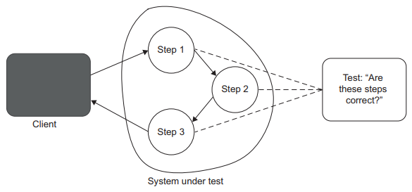
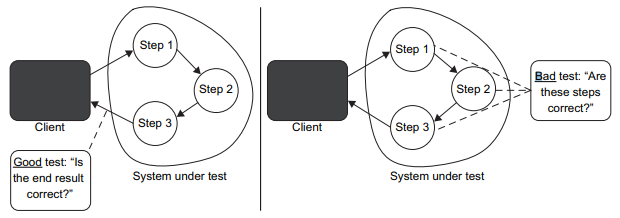

Chapter 4-The Four Pillars of a Good Unit Test
==============================

## Diving into The Four Pillars of a Good Unit Test

A good unit test has the following four attributes:

<ul>
  <li>Protection against regresssions</li>
  <li>Resistance to refactoring</li>
  <li>Fast feedback</li>
  <li>Maintainability</li>
</ul> 

#### The First Pillar: Protection Against Regressions

As you know from chapter 1, a regression is a software bug. It's when a feature stops working as intended after some code modification, usually after you roll out new functionality.

#### The Second Pillar: Resistance to Refactoring

The second attribute of a good unit test is resitance to refactoring-the degree to which a test can sustain a refactoring of the underlying application code without turning red (failing).

A false positive is a false alarm. It's a result indicating that the test fails, although in reality, the functionality it covers works as intended, Such false positives usually take place when you refactor the code—when you modify the implementation but keep the observable behavior intact. Hence the name for this attribute of a good unit test: resistance to refactoring.

#### What Causes False Positives?

The number of false positives a test produces is directly related to the way the test is structured. the more the test is coupled to the implementation details of the system under the test (SUT), the more false alarms it generates. The only way to reduce the chance of getting a false positive is to decouple the test from those implementation details. You need to make sure the test verfies the end result the SUT delivers: its observable behavior, not the steps it takes to do that.

Take a look at the following example. In it, the MessageRenderer class generates an HTML representation of a message containing a header, a body, and a footer:
```C#
public class Message {
   public string Header { get; set; }
   public string Body { get; set; }
   public string Footer { get; set; }
}

public interface IRenderer {
   string Render(Message message);
}

public class MessageRenderer : IRenderer {
   public IReadOnlyList<IRenderer> SubRenderers { get; }

   public MessageRenderer() {
      SubRenderers = new List<IRenderer> {
         new HeaderRenderer(),
         new BodyRenderer(),
         new FooterRenderer()
      }
   }

   public string Render(Message message) {
      return SubRenderers.Select(x => x.Render(message)).Aggregate("", (str1, str2) => str1 + str2);
   }
}

public class BodyRenderer : IRenderer {
   public string Render(Message message) {
      return $"<b>{message.Body}</b>";
   }
}

[Fact]
public void MessageRenderer_uses_correct_sub_renderers() {
   var sut = new MessageRenderer();

   IReadOnlyList<IRenderer> renderers = sut.SubRenderers;

   Assert.Equal(3, renderers.Count);
   Assert.IsAssignableFrom<HeaderRenderer>(renderers[0]);
   Assert.IsAssignableFrom<BodyRenderer>(renderers[1]);
   Assert.IsAssignableFrom<FooterRenderer>(renderers[2]);
}
```
This test checks to see if the sub-renderers are all of the expected types and appear in the correct order, which presumes that the way MessageRenderer processes messages must also be correct. The test might look good at first, but does it really verify MessageRenderer's observable behavior? What if you rearrange the sub-renderers, or replace one of them with a new one? Will that lead to a bug? the test will turn red if you do any of that, even though the end result won't change. That’s because the test couples to the SUT’s implementation details and not the outcome the SUT produces. This test inspects the algorithm and expects to see one particular implementation, without any consideration for equally applicable alternative implementations .



The correct way to do the test is to decoup the test with implementation details and only test the end result as:
```C#
[Fact]
public void Rendering_a_message() {
   var sut = new MessageRenderer();
   var message = new Message { Header = "h", Body = "b", Footer = "f" };

   string html = sut.Render(message);

   Assert.Equal("<h1>h</h1><b>b</b><i>f</i>", html);
}
```




<!-- <div class="alert alert-info p-1" role="alert">
    
</div> -->

<!--  -->

<!-- <code>&lt;T&gt;</code> -->

<!-- <div class="alert alert-info pt-2 pb-0" role="alert">
    <ul class="pl-1">
      <li></li>
      <li></li>
    </ul>  
</div> -->

<!-- <ul>
  <li><b></b></li>
  <li><b></b></li>
  <li><b></b></li>
  <li><b></b></li>
</ul>  -->

<!-- <span style="color:red">hurt</span> -->

<style type="text/css">
.markdown-body {
  max-width: 1800px;
  margin-left: auto;
  margin-right: auto;
}
</style>

<link rel="stylesheet" href="./zCSS/bootstrap.min.css">
<script src="./zCSS/jquery-3.3.1.slim.min.js"></script>
<script src="./zCSS/popper.min.js"></script>
<script src="./zCSS/bootstrap.min.js"></script>