Chapter 5-Mocks and Test Fragility
==============================

## The Types of Test Doubles

A *test double* is a term that describes all kinds of non-production-ready, fake dependencies in tests. The term comes from the notion of a stunt double in a movie. The major use of test doubles is to facilitate testing; they are passed to the system under test instead of real dependencies, which could be hard to set up or maintain.

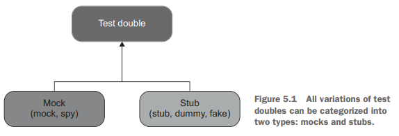

The difference between these two types boils down to the following:

<ul>
  <li>Mocks help to emulate and examine <i>outcoming</i> interactions. These interactions are calls the SUT makes to its dependencies to change their state.</li>
  <li>Stubs help to emulate <i>incoming</i> interactions.</li>
</ul> 

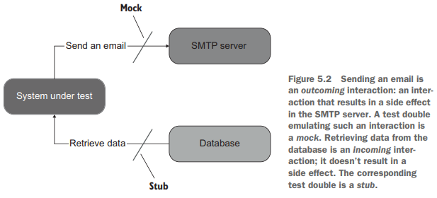

All other differences between the five variations are insignificant implementation details. For example, spies serve the same role as mocks. The distinction is that spies are written manually, whereas mocks are created with the help of a mocking framework. Sometimes people refer to spies as handwritten mocks.

On the other hand, the difference between a stub, a dummy, and a fake is in how intelligent they are. A dummy is a simple, hardcoded value such as null value or a made-up string. It's used to satisfy the SUT's method signature and doesn't participate in producing the final outcome. A stub is more sophisticated. It's a fully fledged dependency that you configure to return different values for different scenarios. Finally, a fake is the same as a stub for most purposes. The difference is in the rationale for its creation: a fake is usually implemented to replace a dependency that doesn't yet exist.

Notice the difference between mocks and stubs. Mocks help to emulate and examine interactions between the SUT and its dependencies, while stubs only help to emulate those interactions, This is an important distinction. 

## Mock (the tool) vs. mock (the test double)

The term mock is overloaded and can mean different things in different circumstances.I mentioned in chapter 2 that people often use this term to mean any test double, whereas mocks are only a subset of test doubles. But there's another meaning for the term mock. You can refer to the classes from mocking libraries as mocks, too. These classes help you create actual mocks, but they themselves are not mocks:
```C#
[Fact]
public void Sending_a_greetings_email() {
   var mock = new Mock<IEmailGateway>();
   var sut = new Controller(mock.Object);

   sut.GreetUser("user@email.com");

   mock.Verify(x => x.SendGreetingsEmail("user@email.com"), Times.Once);
}
```
Note that you can use a mock (the tool) to create both types of test doubles: mocks and stubs. The test in the following listing also uses the Mock class, but the instance of that class is not a mock, it's a stub:
```C#
[Fact]
public void Creating_a_report() {
   var stub = new Mock<IDatabase>();   // <--- Uses a mock (the tool) to create a stub
   stub.Setup(x => x.GetNumberOfUsers()).Returns(10);
   var sut = new Controller(stub.Object);

   Report report = sut.CreateReport();

   Assert.Equal(10, report.NumberOfUsers);
}
```
This test double emulates an **incoming** interaction—a call that provides the SUT with input data. On the other hand, in the previous example (listing 5.1), the call to SendGreetingsEmail() is an **outcoming** interaction. Its sole purpose is to incur a side effect—send an email.

## Don't assert interactions with stubs

Mocks help to emulate and examine outcoming interactions between the SUT and its dependencies, while stubs only help to emulate incoming interactions, not examine them. A call from the SUT to a stub is not part of the end result the SUT produces. Such a call is only a means to produce the end result: a stub provides input from which the SUT then generates the output. Asserting interactions with stubs is a common anti-pattern that leads to fragile tests.

The call to GetNumberOfUsers() in listing 5.2 is not an outcome at all. It’s an internal implementation detail regarding how the SUT gathers data necessary for the report creation. Therefore, asserting this call would lead to test fragility, it shouldn't matter how the SUT generates the end result, as long as that result is correct. The following listing shows an example of such a brittle test.
```C#
[Fact]
public void Creating_a_report() {
   var stub = new Mock<IDatabase>();
   stub.Setup(x => x.GetNumberOfUsers()).Returns(10);
   var sut = new Controller(stub.Object);

   Report report = sut.CreateReport();

   Assert.Equal(10, report.NumberOfUsers);
   stub.Verify(x => x.GetNumberOfUsers(), Times.Once);   // <--- Asserts the interaction with the stub
}
```
Checking for interactions with stubs is a flaw that's quite easy to spot because tests shouldn't check for any interactions with stubs. Mocks are a more complicated subject: not all uses of mocks lead to test fragility, but a lot of them do. You'll see why later in this chapter.

## Using mocks and stubs together

Sometimes you need to create a test double that exhibits the properties of both a mock and a stub:
```C#
[Fact]
public void Purchase_fails_when_not_enough_inventory() {
   var storeMock = new Mock<IStore>();
   storeMock
      .Setup(x => x.HasEnoughInventory(Product.Shampoo, 5))
      .Returns(false);
   var sut = new Customer();

   bool success = sut.Purchase(storeMock.Object, Product.Shampoo, 5);

   Assert.False(success);
   storeMock.Verify(x => x.RemoveInventory(Product.Shampoo, 5), Times.Never);
}
```
Notice, though, that these are two different methods: the test sets up the answer from HasEnoughInventory() but then verifies the call to RemoveInventory(). Thus, the rule of not asserting interactions with stubs is not violated here.

When a test double is both a mock and a stub, it's still called a mock, not a stub. That's mostly the case because we need to pick one name, but also because being a mock is a more important fact than being a stub.

## How mocks and stubs relate to commands and queries

The notions of mocks and stubs tie to the command query separation (CQS) principle. THe CQS principle states that every method should be either a command or a query, but not both.

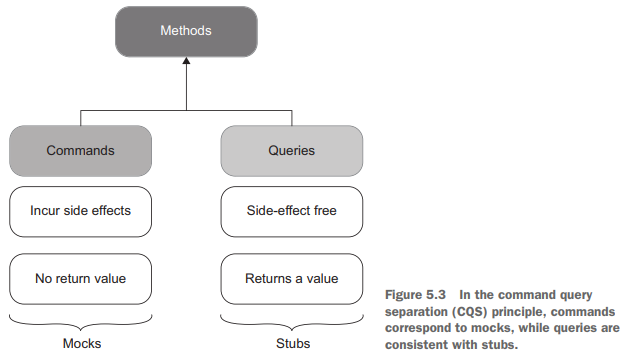

Commands are methods that produce side effects and don't return any value (return void). Examples of side effects include mutating an object's state, changing a file in the file system, and so on. Queries are the opposite of that-they are side effect free and return a value. To follow this principle, be sure that if a method produces a side effect, that method's return type is void. And if the method returns a value, it must stay side-effect free. Code that maintains such a clear separation becomes easier to read. You can tell what a method does just by looking at its signature, without diving into its implementation details.

Of course, it's not always possible to follow the CQS principle. There are always methods for which it makes sense to both incur a side effect and return a value. A classical example is stack.Pop(). Still, it's a good idea to adhere to the CQS principle whenever you can.

Test doubles that substitute commands become mocks. Similarly, test doubles that substitute queries are stubs:
```C#
var mock = new Mock<IEmailGateway>();
mock.Verify(x => x.SendGreetingsEmail("user@email.com"));

var stub = new Mock<IDatabase>();
stub.Setup(x => x.GetNumberOfUsers()).Returns(10);
```
SendGreetingsEmail() is a command whose side effect is sending an email. The test double that substitutes this command is a mock. On the other hand, GetNumberOfUsers() is a query that returns a value and doesn’t mutate the database state. The corresponding test double is a stub. 

## Observable behavior vs. implementation details

Test fragility corresponds to the second attribute of a good unit test: resistance to refactoring. The metric of resistance to refactoring is the most important because whether a unit test possesses this metric is mostly a binary choice. Thus, it's good to max out this metric to the extent that the test still remains in the realm of unit testing. In chapter 4, you also saw that the main reason tests deliver false positives (and thus fail at resistance to refactoring) is because they couple to the code’s implementation details. The only way to avoid such coupling is to verify the end result the code produces
(its observable behavior) and distance tests from implementation details as much as possible. In other words, tests must focus on the whats, not the hows. So, what exactly is an implementation detail, and how is it different from an observable behavior?

## Observable behavior is not the same as a public API

All production code can be categorized along two dimensions:

<ul>
  <li>Public API vs. private API</li>
  <li>Observable behavior vs. implementation details</li>
</ul> 

The categories in these dimensions don’t overlap. A method can’t belong to both a public and a private API; it's either one or the other. Similarly, the code is either an internal implementation detail or part of the system’s observable behavior, but not both.

The distinction between observable behavior and internal implementation details is more less obvious. For a piece of code to be part of the system's observable behavior, it has to do one of the following things:

<ul>
  <li>Expose an operation that helps the client achieve one of its goals. An operation is a method that performs a calculation or incurs a side effect or both.</li>
  <li>Expose a state that helps the client achieve one of its goals. State is the current condition of the system.</li>
</ul>
Any code that does neither of these two things is an implementation detail

Notice that whether the code is observable behavior depends on who its client is and what the goals of that client are. In order to be part of observable behavior, the code needs to have an immediate connection to at least one such goal. The word client can refer to different things depending on where the code resides. The common example are client code from the same code base, an external applicationm, or the user interface.

Ideally, the system’s public API surface should coincide with its observable behavior, and all its implementation details should be hidden from the eyes of the clients. Such a system has a well-designed API:

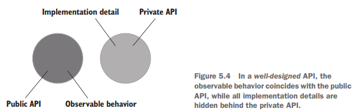

Often, though, the system's public API extends beyond its observable behavior and starts exposing implementation details. Such a system's implementation details leak to its public API surface:

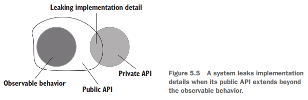

The picture above shows an bad API design that leaks implementaion details into public API, these implementationdetails should be in private API.

## Leaking implementation details: An example with an operation

Below code shows a User class with a public API that consists of two members: a Name property and a NormalizeName() method. The class also has an requirement: users' names must not exceed 50 characters and should be truncated otherwise.

```C#
public class User {
   public string Name { get; set; }

   public string NormalizeName(string name) {
      string result = (name ?? "").Trim();

      if (result.Length > 50)
         return result.Substring(0, 50);
      
      return result;
   }
}

public class UserController {
   public void RenameUser(int userId, string newName) {
      User user = GetUserFromDatabase(userId);

      string normalizedName = user.NormalizeName(newName);
      user.Name = normalizedName;

      SaveUserToDatabase(user);
   }
}
```
So, why isn’t User's API well-designed? Look at its members once again: the Name property and the NormalizeName method. Both of them are public. Therefore, in
order for the class’s API to be well-designed, these members should be part of the observable behavior. This, in turn, requires them to do one of the following two things (which I'm repeating here for convenience):

<ul>
  <li>Expose an operation that helps the client achieve one of its goals. An operation is a method that performs a calculation or incurs a side effect or both.</li>
  <li>Expose a state that helps the client achieve one of its goals. State is the current condition of the system.</li>
</ul>

Only the Name property meets this requirement. It exposes a setter, which is an operation that allows UserController to achieve its goal of changing a user's name. The NormalizeName method is also an operation, but it doesn't have an **immediate** connection to the client's goal. The only reason UserController calls this method is to satisfy the invariant of User. NormalizeName is therefore an implementation detail that leaks to the class's public API. Think about it, what if the other developers just use Name setter to set the name that has more than 50 characters?

To fix the situation and make the class's API well-designed, User needs to hide NormalizeName() and call it internally as part of the property's setter without relying on the client code to do so:
```C#
public class User {
   private string _name;
   public string Name {
      get => _name;
      set => _name = NormalizeName(value);
   }

   private string NormalizeName(string name) {
      string result = (name ?? "").Trim();

      if (result.Length > 50)
         return result.Substring(0, 50);
      
      return result;
   }
}

public class UserController {
   public void RenameUser(int userId, string newName) {
      User user = GetUserFromDatabase(userId);
      user.Name = newName;
      SaveUserToDatabase(user);
   }
}
```
There's a good rule of thumb that can help you determine whether a class leaks its implementation details. If the number of operations the client has to invoke on the class to achieve a single goal is greater than one, then that class is likely leaking implementation details. Ideally, any individual goal should be achieved with a single operation.

## Leaking implementation details: An example with state

The example shown before demonstrated an operation (the NormalizeName method) that was an implementation detail leaking to the public API. Let's also look
at an example with state. The following listing contains the MessageRenderer class you saw in chapter 4. It uses a collection of sub-renderers to generate an HTML representation of a message containing a header, a body, and a footer:
```C#
public class MessageRenderer : IRenderer {
   public IReadOnlyList<IRenderer> SubRenderers { get; }   // <--- should be private

   public MessageRenderer() {
       SubRenderers = new List<IRenderer> { new HeaderRenderer(), new BodyRenderer(), new FooterRenderer() };
   }

   public string Render(Message message) {
      return SubRenderers.Select(x => x.Render(message)).Aggregate("", (str1, str2) => str1 + str2);
   }
}
```
The sub-renderers collection is public. But is it part of observable behavior? Assuming that the client's goal is to render an HTML message, the answer is no. The only class member such a client would need is the Render method itself. Thus SubRenderers is also a leaking implementation detail.

As you can see, there's an intrinsic connection between good unit tests and a welldesigned API. By making all implementation details private, you leave your tests no choice other than to verify the code’s observable behavior, which automatically improves their resistance to refactoring. On other words, **Making the API well-designed automatically improves unit tests**.

## The relationship between mocks and test fragility

In this section, you will learn about hexagonal architecture, the difference between internal and external communications, and the relationship between mocks and test fragility.

####  Defining hexagonal architecture

A typical application consists of two layers, domain and application services.

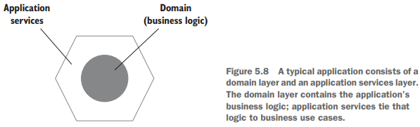

The domain layer resides in the middle of the diagram because it's the central part of your application. It contains the business logic: the essential
functionality your application is built for. The domain layer and its business logic differentiate this application from others and provide a competitive advantage for the organization.

The application services layer sits on top of the domain layer and orchestrates communication between that layer and the external lworld. For example, if you application is a RESTful API, all requests to this API hit the application services layer first. This layer then coordinates the work between domain classes and out-of-process dependencies. Here's an example of such coordination for the application service. It does the following:

<ul>
  <li>Queries the database and uses the data to materialize a domain class instance</li>
  <li>Invokes an operation on that instance</li>
  <li>Saves the results back to the database</li>
</ul> 

The combination of the application services layer and the domain layer forms a hexagon, which itself represents your application. It can interact with other applications, which are represented with their own hexagons:

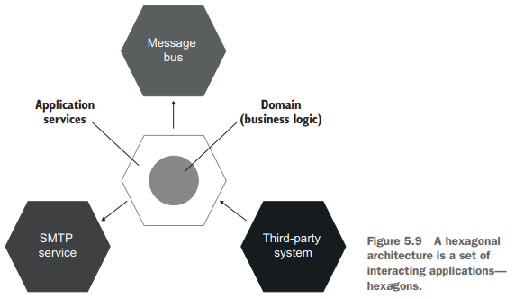

These other applications could be an SMTP service, a third-party system, a message bus, and so on. A set of interacting hexagons makes up a *hexagonal architecture*.

The purpose of hexagonal architecture emphasize three important guidelines:

<ul>
  <li><b>The separation of concerns between the domain and application services layers</b> Business logic is the most important part of the application. Therefore, the domain layer should be accountable only for that business logic and exempted from all other responsibilities. Those responsibilities, such as communicating with external applications and retrieving data from the database, must be attrivuted to application services. Conversely, the application services shouldn't contain any business logic. Their responsibility is to adapt the domain layer by translating the incoming requests into operations on domain classes and then persisiting the results or returning them back to the caller. You can view the domain layer as a collection of the application's domain knowledge (how to) and the application services layer as a set of business use cases (what to).</li>
  <li><b>Communications inside your application</b> Hexagonal architecture prescribes a one-way flow of dependencies: from the application services layer to the domain layer. Classes inside the domain layer should only depend on each other; they should not depend on classes from the application services layer. This guideline flows from the previous one. The separation of concerns between the application services layer and the domain layer means that the former knows about the latter, but the opposite is not true. The domain layer should be fuylly isolated from the external world.</li>
  <li><b>Communications beween applications</b> External applications connect to your application through a common interface maintained by the application services layer. No one has a direct access to the domain layer. Each side in a hexagon represents a connection into or out of the application. Note that although a hexagon has six sides, it doesn't mean you application can only connect to six other applications. The point is that there can be many such connections.</li>
</ul> 

Each layer of your application exhibits observable behavior and contains its own set of implementation details. For example, observable behavior of the domain layer is the sum of this layer's operations and state that helps the application service layer achieve at least one of its goals. The principles of a well-designed API have a fractal nature: they apply equally to as much as a whole layer or as little as a single class.

When you make each layer’s API well-designed (that is, hide its implementation details), your tests also start to have a fractal structure; they verify behavior that helps achieve the same goals but at different levels. A test covering an application service checks to see how this service attains an goal posed by the external client. At the same time, a test working with a domain class verfies a subgoal that is part of that greater goal:

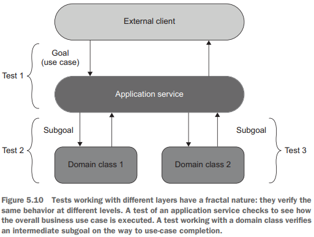

You might remember from previous chapters how I mentioned that you should be able to trace any test back to a particular business requirement. Each test should tell a story that is meaningful to a domain expert, and if it doesn't, that's a strong indication that the test couples to implementation details and therefore is brittle. I hope you now can see why.

Observable behavior flows inward from outer layers to the center. The goal posed by the external clients gets translated into subgoals achieved by individual domain classes. Each piece of observable behavior in the domain layer therefore preserves the connection to a particular business use case. You can trace this connection recursively from the innermost domain layer outward to the application services alyer and then to the needs of the external client. This traceability follows from the definition of observable behavior. For a piece of code to be part of observable behavior, it needs to help the cllient achieve one of its goals. For a domain class, the client is an application service; for the application services, it's the external client itself.

Tests that verify a code base with a well-designed API also have a connection to business requirements because those tests tie to the observable behavior only. A good example is the User and UserController classes from listing 5.6 (I’m repeating the code here for convenience):
```C#
public class User {
   private string _name;
   public string Name {
      get => _name;
      set => _name = NormalizeName(value);
   }

   private string NormalizeName(string name) {
      /* Trim name down to 50 characters */
   }
}

public class UserController {
   public void RenameUser(int userId, string newName) {
      User user = GetUserFromDatabase(userId);
      user.Name = newName;
      SaveUserToDatabase(user);
   }
}
```
UserController in this example is an application service. Assuming that the external client doesn't have a specific goal of normalizing user names, and all names are normalized solely due to restrictions from the application itself, the NormalizeName method in the User class can't be traced to the client's needs. Therefore, it's an implementation detail and should be made private (we already did that earlier in this chapter). Moreover, tests shouldn't check this method directly. They should verify it only as part of the class's observable behavior-the Name property's setter in this example. Note that it doesn't mean you don't need to test NormalizeName method, what you need to do is to test it "indirectly" by designing an appropriate test , indirectly, through the public User.name property, not with a test that directly calls NormalizeName as :
```C#
[Fact]
public void NameProperty_TrimsLongNames()
{
   // arrange
   User user = new User();
   string name = "very very very long name... and even longer... and still longer";
   string expectedName = "very very very long name... and even longer... an";

   // act
   user.Name = name;

   // assert
   Assert.AreEqual(user.Name, expectedName);
}
```

This guidelline of always tracing the code base's publid API to business requirements applies to the vast majority of domain classes and application services but less so to utility and infrastructure code. The individual problems such code solves are often too low-level and fine-grained and can't be traced to a specific business use case. 

## Intra-system vs inter-system communications

There are two types of communications in a typical application: intra-system and inter-system. Intra-system communications are communications between classes inside your application. Inter-system communications are when your application talks to other applications:

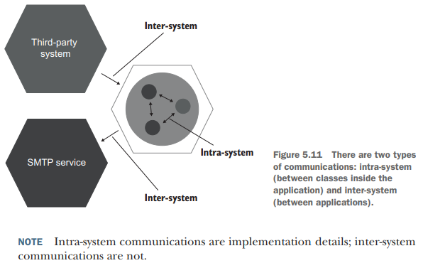

Intra-system communications are implementation details because the collaborations your domain classes go through in order to perform an operation are not part of their observable behavior. These collaborations don't have an immediate connection to the client's goal. Thus, coupling to such collaborations leads to fragile tests.

Inter-system communications are different matter. Unlike collaborations between classes inside your application, the way your system talks to the external world forms the observable behavior of that system as a whole. It's part of the contract you application must hold at all time.

This attribute of inter-system communications stems from the way separate applications evolve together. One of the main principles of such an evolution is maintaining backward compatibility. **Regardless of the refactorings you perform inside your system, the communication pattern it uses to talk to external applications should always stay in place, so that external applications can understand it**. (I think the author means your application will keep APIs that communicates to external applications unchanged almost all of time because if you change your API, then external applications won't be able to talk with your application. Therefore it is good to use Mock to test inter-system communications, because the API won't change, but it is bad to use mock to test intra-system communication because you might change the implementation details all the time, e.g. add an extra parameter type in a method's signature)For example, messages your application emits on a bus should preserve their structure, the calls issued to an SMTP service should have the same number and type of parameters, and so on.

The use of mocks is beneficial when verifying the communication pattern between your system and external applications. Conversely, using mocks to verify communications between classes inside your system results in tests that couple to implementation details and therefore fall short of the resistance-to -refactoring metric.

#### Intra-system vs inter-system communications: An example

To illustrate the difference between intra-system and inter-system communications. I'll expand on the example with the Customer and Store classes that I used in chapter 2 and earlier in this chapter. Imagine the following business use case:

<ul>
  <li>A customer tries to purchase a product from a store</li>
  <li>If the amount of the product in the store is sufficient, then: The inventory is removed from the store; An email receipt is sent to the customer; A confirmation is returned</li>
</ul> 

Let's also assume that the application is an API with no user interface.

In the following listing, the CustomerController class is an application service that orchestrates the work between domain classes (Customer, Product, Store) and the external application (EmailGateway, which is a proxy to an SMTP service)
```C#
// Connecting the domain model with external applications
public class CustomerController {
   public bool Purchase(int customerId, int productId, int quantity) {
      Customer customer = _customerRepository.GetById(customerId);
      Product product = _productRepository.GetById(productId);

      bool isSuccess = customer.Purchase(_mainStore, product, quantity);

      if (isSuccess) {
         _emailGateway.SendReceipt(customer.Email, product.Name, quantity);
      }

      return isSuccess;
   }
}
```
Validation of input parameters is omitted for brevity. In the Purchase method, the customer checks to see if there's enough inventory in the store and, if so, decreases the product amount.

The act of making a purchase is a business use case with both intra-system and inter-system communications. The inter-system communications are those between the CustomerController application service and the two external systems: the thirdparty application (which is also the client initiating the use case) and the email gateway. The intra-system communication is between the Customer and the Store domain classes:

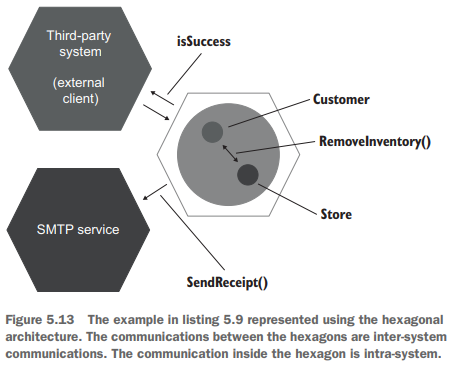

In this example, the call (`SendRecipt()`) to the SMTP service is a side effect that is visible to the external world and thus forms the observable behavior of the application as a whole. It also has a direct connection to the client's goals. The client of the application is the third-party system. This system's goal is to make a purchase, and it expects the customer to receive a confirmation email as part of the successful outcome.

The call to the SMTP service is a legitimate reason to do mocking. It doesn't lead to test fragility because you want to make sure this type of communication stays in place even after refactoring. The use of mocks helps you do exactly that. The next listing shows an example of a legitimate use of mocks:
```C#
//  Mocking that doesn't lead to fragile tests
[Fact]
public void Successful_purchase() {
   var mock = new Mock<IEmailGateway>();
   var sut = new CustomerController(mock.Object);

   bool isSuccess = sut.Purchase(customerId: 1, productId: 2, quantity: 5);

   Assert.True(isSuccess);
   mock.Verify(x => x.SendReceipt("customer@email.com", "Shampoo", 5), Times.Once);   // <--- Verifies that the system sent a receipt about the purchase
}
```

Let's now look at a fragile test that mocks the communication between Customer and Store:
```C#
// Mocking that leads to fragile tests
[Fact]
public void Purchase_succeeds_when_enough_inventory() {
   var storeMock = new Mock<IStore>();
   storeMock.Setup(x => x.HasEnoughInventory(Product.Shampoo, 5)).Returns(true);
   var customer = new Customer();

   bool success = customer.Purchase(storeMock.Object, Product.Shampoo, 5);

   Assert.True(success);
   storeMock.Verify(x => x.RemoveInventory(Product.Shampoo, 5), Times.Once);   // <---- RemoveInventory is implementation details
}
```
The only two members that have an immediate connection to this goal are customer.Purchase() and store.GetInventory(). The Purchase() method initiates the purchase, and GetInventory() shows the state of the system after the purchase is completed. The RemoveInventory() method call is an intermediate step on the way to the client’s goal—an implementation detail. 

## The classical vs. London schools of unit testing, revisited

I mentioned that I prefer the classical school of unit testing over the London school. I hope now you can see why. The London school encourages the use of mocks for all but immutable dependencies and doesn't differentiate between intra-system and inter-system communications. As a result, tests check communications between classes just as much as they check communications between your application and external systems.

This use of mocks is why following the London school often results in tests that couple to implementation details and thus lack resistance to refactoring. A s you may remember, the metric of resistance to refactoring is mostly a binary choice: a test either has resisitance to refactoring or it doesn't Compromising on this metric renders the test nearly worthless.

The classical school is much better at this ussye because it advocates for sybstituting only dependencies that are shared bewtween tests, which almost always trnaslates into out-of-process dependencies such as SMTP service, a message bus, and so on. 

## Not all out-of-process dependencies should be mocked out

If a shared dependency is not out-of-process, then it's easy to avoid reusing it in tests by providing a new instance of it on each test run. In cases where the shared dependency is out-of-process, testing becomes more complicated. You can’t instantiate a new database or provision a new message bus before each test execution; that would drastically slow down the test suite. The usual approach is to replace such dependencies with test doubles—mocks and stubs.

Not all out-of-process dependencies should be mocked out, though. **If an out-of-process dependency is only accessible through your application, then communications with such a dependency are not part of your systems's observable behavior**. An out-of-process dependency that can't be observed externally, in effect, acts as part of your application

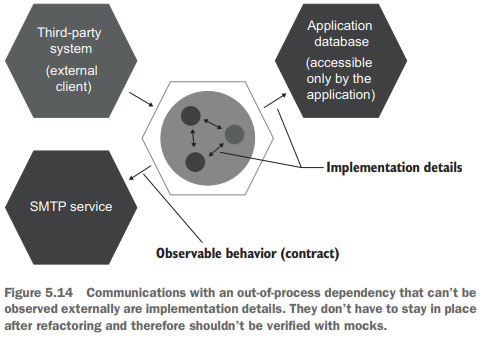

when your application acts as a proxy to an external system, and no client can access it directly, the backward-compatibility requirement vanishes. Now you can deploy your application together with this external system, and it won’t affect the clients. The communication pattern with such a system becomes an implementation detail.

A good example here is an application database: a database that is used only by your application. No external system has access to this database. Therefore, you can modify the communication pattern between your system and the application database in any way you like, as long as it doesn't break existing functionality. Because that database is completely hidden from the eyes of the clients, you can even replace it with an entirely different storage mechanism, and no one will notice.

The use of mocks for out-of-process dependencies that you have a full control over also leads to brittle tests. You don't want your tests to turn red every time you spilt a table in the database or modify the type of one of the parameters in a stored procedure. The database and your application must be treated as one system.

This obviously poses an issue. How would you test the work with such a dependency without compromising the feedback speed, the third attribute of a good unit
test? You’ll see this subject covered in depth in the following two chapters.


<!-- <div class="alert alert-info p-1" role="alert">
    
</div> -->

<!--  -->

<!-- <code>&lt;T&gt;</code> -->

<!-- <div class="alert alert-info pt-2 pb-0" role="alert">
    <ul class="pl-1">
      <li></li>
      <li></li>
    </ul>  
</div> -->

<!-- <ul>
  <li><b></b></li>
  <li><b></b></li>
  <li><b></b></li>
  <li><b></b></li>
</ul>  -->

<!-- <span style="color:red">hurt</span> -->

<style type="text/css">
.markdown-body {
  max-width: 1800px;
  margin-left: auto;
  margin-right: auto;
}
</style>

<link rel="stylesheet" href="./zCSS/bootstrap.min.css">
<script src="./zCSS/jquery-3.3.1.slim.min.js"></script>
<script src="./zCSS/popper.min.js"></script>
<script src="./zCSS/bootstrap.min.js"></script>